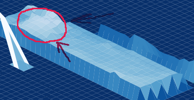

# Макет сборщика магнитов

Демонстрация атомной сборки с магнитными шариками, роботизированной рукой и прототипом настоящего программного обеспечения.

## Description
Цель проекта — написать софт, абстрагировавшись от конкретной конструкции манипулятора. И отработать 
его на одной из возможных реализаций макромодели манипулятора.

Необходимые функции: 
- Манипулятор должен "на ощупь" с помощью датчиков строить модель поверхности, не касаясь ее.
- Опознавать атомы (магнитики)
- Опознавать, что атом (магнитик) соеденился с наконечником
- Переместить атом (магнитик) в заданное место и распознать отсоединение от наконечника   
  
  Получившийся скан поверхности, где красным выделена возвышенность - точечный магнит.
  Это достигается инфракрасным датчиком поверхности, когда он сканирует белый магнит на черном фоне. 
  

## Installation
#### 1. Установка всех зависимостей. 
Для этого нужна установленная conda.  
Установить зависимости:

    conda env create -f environment.yml
   
#### 2. Cоздать в корне проекта файл .env  
Прописать в нем 2 параметра: 
    
    IP = '111.111.0.111'
    PORT = 8266

IP - ip компьютера в локальной сети в виде строки.  
Узнать в Linux можно командой:  

    hostname -I

PORT - любой свободный порт

#### 3. Соединение с клиентом микроконтроллера через wifi
В директории esp8266 создать файл cred.py
Прописать в нем параметры:

    IP = '111.111.0.111'
    PORT = 8266
    ESSID = 'wifi-networke-name'
    PASS = 'wifi-pass'

IP и PORT - такие же как в .env, ESSID и PASS - название сети и пароль wifi соответственно.  
Затем в микроконтроллер с модулем wifi и с прошитым micropython нужно перекинуть все файлы из директории esp8266
в корневой каталог микроконтроллера.

#### 4. Тестовоя заклушка для МК
В директории stub_microcontroller лежит код для програмной эмуляции работы реального МК.  
Для его работы нужно скопировать файл cred.py из esp8266 в stub_microcontroller.

## Usage
В корне проекта запустить

    python main.py     
        
При загрузке микроконтроллера, должен автоматически запускается скрипт из main.py,
где происходит соединение с запущенным сервером на ПК.  
При успешном подключении клиента микроконтроллера в консоли сервера пишется:   
    
    'hi_esp8266'

Для подключения тестовой заглушки МК:
    
    python stub_microcontroller/main.py

## Roadmap
Возможные будущие улучшения:
- Реализовать алгоритмы Лапшина по поиску особенностей!
- Хранить отсканированные атомы в памяти в AtomCollection и удобно отображать на карте актуальные данные (Когда появится датчик захвата атома на инструменте)
- Сделать сохранение и загрузку данных в базу или файл

## Contributing
